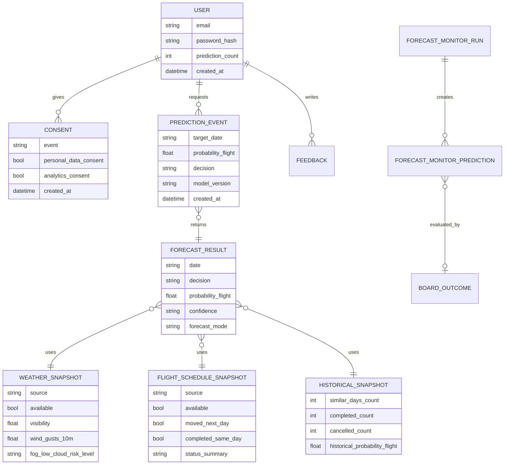

# Летит на Курилы? / flyforecast.ru

`flyforecast` — ML-backed сервис для оценки вероятности выполнения авиарейса из/в аэропорт Менделеево на о. Кунашир.

Домен проекта: [`flyforecast.ru`](https://flyforecast.ru)  
Репозиторий: `Vladimir-Zimin226/flyforecast`

Сервис не является официальным источником статуса рейсов, не гарантирует выполнение рейса и не утверждает, что точно знает будущую погоду. Он даёт вероятностную оценку на основе исторических данных, сезонности, погодных факторов, baseline/ML-логики и объяснения для пользователя.

---

## Цель проекта

Главная задача проекта — помочь жителям Кунашира и другим пассажирам планировать выезд с острова с меньшей неопределённостью.

Сервис отвечает не на вопрос «точно ли полетит самолёт?», а на более честный вопрос:

> Насколько выбранная дата похожа на более или менее благоприятное окно для выполнения рейса?

Текущий пользовательский сценарий:

1. Пользователь заходит на `flyforecast.ru`;
2. Видит уведомление о необходимых cookies/localStorage и отдельное согласие на аналитику Яндекс Метрики;
3. Выбирает дату от сегодня до +365 дней и получает прогноз;
4. Без регистрации может сделать до 5 бесплатных прогнозов;
5. После 5-го прогноза сервис предлагает создать личный кабинет для дальнейшей бесплатной работы;
6. При регистрации пользователь указывает имя, email и пароль, а также даёт согласие на обработку персональных данных;
7. В личном кабинете пользователь видит статистику своих прогнозов и может оставить обратную связь;
8. Администратор входит через обычную форму входа и видит пользователей, их прогнозы, согласия и отзывы в закрытой админской зоне.

---

## Текущий статус

Сделан работающий vertical slice публичного сервиса:

- frontend на React/Vite;
- backend на FastAPI;
- Docker Compose для dev/prod;
- production deploy на сервере;
- доступ через `https://flyforecast.ru`;
- HTTPS через Let's Encrypt / Certbot;
- reverse proxy через nginx;
- регистрация и вход по email/паролю;
- личный кабинет пользователя со статистикой прогнозов и формой обратной связи;
- закрытая админка без публичной кнопки входа;
- админские учётные данные через `.env`;
- хранение пользователей, согласий, прогнозных событий и отзывов в Postgres;
- ограничение: 5 бесплатных прогнозов без регистрации, без лимита для администратора;
- endpoint прогноза `/predict?date=YYYY-MM-DD`;
- Open-Meteo forecast API с fog/low-cloud признаками для Менделеево;
- детерминированное пользовательское объяснение: табло, погодные факторы или исторический текст;
- baseline-расчёт вероятности `mvp-baseline-009`;
- legacy JSONL-логирование прогнозов для совместимости с monitor/pipeline;
- hourly collector статусов рейсов по табло аэропорта;
- forecast monitor для ledger прогнозов, фактов и метрик качества;
- рабочий v3 dataset с ручной проверкой и board evidence.

Внешняя LLM не используется: объяснение собирается кодом из уже рассчитанных факторов.

---

## Соответствие требованиям к MVP из курса «Практическая ML-инженерия»

| Требование | Как реализовано в проекте |
| --- | --- |
| Спроектировать доменную модель сервиса | Доменная модель описана ниже: пользователь, прогноз, погодный снимок, расписание/табло, исторический снимок, согласия, обратная связь и сервисные результаты мониторинга. |
| Обеспечить хранение данных за счет СУБД | Postgres хранит пользователей, хеши паролей, согласия, события прогнозов и обратную связь. Сервисные данные мониторинга и погодного кэша в MVP вынесены в локальные SQLite/CSV-файлы в `data/`. |
| Реализовать REST интерфейс | FastAPI backend: `/health`, `/predict`, `/auth/register`, `/auth/login`, `/me`, `/feedback`, `/consents`, `/admin/users`, `/admin/services`, `/admin/backup`. |
| Реализовать пользовательский интерфейс | React/Vite frontend: экран прогноза, регистрация, вход, личный кабинет, форма обратной связи, cookie/analytics consent, закрытая админка. |
| Покрыть тестами критические части | Unit-тесты в `backend/tests/`: predictor baseline, flight schedule, explanations, auth, weather fallback/circuit breaker, forecast monitor outcomes, admin backup. |
| Упаковать сервис в Docker контейнер | `backend/Dockerfile`, `frontend/Dockerfile`, `frontend/Dockerfile.prod`, `docker-compose.yml`, `docker-compose.prod.yml`. |
| Обеспечить возможность масштабировать количество воркеров с моделью | Backend/model workers масштабируются через `WEB_CONCURRENCY`; фоновые процессы `collector` и `forecast_monitor` вынесены в отдельные Docker-сервисы. |

## Доменная модель сервиса

Основная доменная идея: пользователь выбирает дату рейса, сервис собирает доступные факторы по погоде, истории и табло аэропорта, рассчитывает вероятность выполнения рейса и сохраняет пользовательское событие прогноза.



Ключевые сущности:

- `User` — зарегистрированный пользователь сервиса.
- `Consent` — события согласий на обработку персональных данных и аналитику.
- `PredictionEvent` — факт пользовательского запроса прогноза.
- `ForecastResult` — рассчитанный ответ: вероятность, решение, режим прогноза и уверенность.
- `WeatherSnapshot` — погодные признаки для даты и аэропорта.
- `FlightScheduleSnapshot` — состояние табло аэропорта: рейс запланирован, задержан, перенесён, выполнен или отсутствует в свежем табло.
- `HistoricalSnapshot` — историческая статистика по календарно близким датам.
- `Feedback` — обратная связь пользователя.
- `ForecastMonitorPrediction` и `BoardOutcome` — служебные сущности для проверки качества прогнозов по фактическому исходу.

---

## Данные

Подробная история работы с данными вынесена в отдельный документ:

```text
docs/data_experiments.md
```

Там зафиксированы:

- первый Telegram dataset;
- historical backfill из Wayback, airportus news и media seed;
- hourly collector онлайн-табло;
- сборка `dataset_daily_flights_v3.csv`;
- ручной review спорных вылетов/невылетов;
- forecast monitor;
- `training_dataset_v1.csv` с погодой Open-Meteo Archive, календарём и rolling-признаками;
- `mendeleyevo_fog_risk_dataset.csv` для анализа тумана, низкой облачности и связи с исходами рейсов.

Текущий production dataset задаётся через:

```env
FLYFORECAST_DATASET_PATH=/app/data/processed/dataset_daily_flights_v3.csv
```

Пользовательские и продуктовые данные хранятся в Postgres:

- зарегистрированные пользователи;
- хеши паролей;
- согласия на обработку персональных данных;
- согласия на аналитику;
- события прогнозов зарегистрированных пользователей;
- счётчики прогнозов;
- обратная связь.

Важно: данные в `data/` и production-база считаются рабочими/ценными и не обязаны коммититься в публичный репозиторий.

Описание текущей прогнозной логики закреплено отдельно:

```text
docs/baseline_model.md
```

---

## Структура проекта

```text
flyforecast/
├── README.md
├── .gitignore
├── .env.example
├── docker-compose.yml
├── docker-compose.prod.yml
├── backend/
├── frontend/
├── pipelines/
├── data/
└── docs/
```

## Backend

Backend находится в `backend/`.

```text
backend/
├── Dockerfile
├── requirements.txt
└── app/
    ├── __init__.py
    ├── main.py
    ├── config.py
    ├── auth.py
    ├── schemas.py
    └── services/
        ├── weather.py
        ├── history.py
        ├── predictor.py
        ├── users.py
        └── llm.py
```

Основные части:

- `backend/app/main.py` — FastAPI endpoints: `/health`, `/auth/register`, `/auth/login`, `/me`, `/feedback`, `/consents`, `/admin/users`, `/predict`.
- `backend/app/config.py` — env-настройки проекта.
- `backend/app/auth.py` — JWT и проверка пользователя/администратора.
- `backend/app/schemas.py` — request/response-схемы, включая email-валидацию и лимит отзыва.
- `backend/app/services/users.py` — Postgres-хранилище пользователей, согласий, прогнозных событий и отзывов.
- `backend/app/services/weather.py` — Open-Meteo forecast API по координатам Менделеево.
- `backend/app/services/fog_risk.py` — единые правила расчёта dew point spread и риска тумана/низкой облачности.
- `backend/app/services/history.py` — historical snapshot из dataset.
- `backend/app/services/predictor.py` — MVP baseline probability/decision/confidence.
- `backend/app/services/explanations.py` — детерминированное объяснение результата для пользователя.

## Frontend

Frontend находится в `frontend/`.

```text
frontend/
├── Dockerfile
├── Dockerfile.prod
├── package.json
├── index.html
├── nginx.conf
└── src/
    ├── main.jsx
    ├── App.jsx
    └── styles.css
```

Основные части:

- `frontend/src/App.jsx` — прогнозный экран, cookie/analytics consent, регистрация, вход, личный кабинет, админка, политика обработки данных.
- `frontend/src/styles.css` — визуальная система, responsive layout, формы, модальные окна, cookie-баннер.
- `frontend/nginx.conf` — SPA fallback для production frontend.

## Pipelines

Основные data/evaluation scripts:

- `pipelines/flight_status/collect_kunashir_status.py` — hourly collector табло.
- `pipelines/flight_status/backfill_historical_status.py` — ретроспективный сбор evidence.
- `pipelines/flight_status/build_dataset_v3.py` — сборка v3 fact dataset.
- `pipelines/evaluation/forecast_monitor.py` — ledger прогнозов и оценка качества.
- `pipelines/training/build_training_dataset_v1.py` — weather-enriched training dataset.
- `pipelines/training/build_mendeleyevo_fog_risk_dataset.py` — отдельный fog-risk dataset по координатам Менделеево.

Подробнее см. `docs/data_experiments.md`.

## Docs

```text
docs/
├── baseline_model.md
├── business_analysis.md
├── dataset_preparation.md
├── data_experiments.md
├── fog_risk_dataset.md
├── forecast_operations.md
├── product_benchmarking.md
├── prototype.md
└── privacy-policy/
```

- `docs/baseline_model.md` — как работает текущий `mvp-baseline-009`.
- `docs/business_analysis.md` — бизнес-анализ MVP.
- `docs/dataset_preparation.md` — отчёт по подготовке датасета для ML-задачи.
- `docs/data_experiments.md` — история источников, датасетов, сборщиков и ML-data экспериментов.
- `docs/fog_risk_dataset.md` — решение по Open-Meteo fog-risk, отложенным FlightRadar/Himawari и командам сборки.
- `docs/forecast_operations.md` — эксплуатационные правила: Open-Meteo guardrail, дальние прогнозы и мониторинг качества.
- `docs/product_benchmarking.md` — продуктовый benchmarking.
- `docs/prototype.md` — описание продуктового прототипа.
- `docs/privacy-policy/` — материалы и образцы для политики обработки персональных данных.

---

## Локальный запуск в dev-режиме

### 1. Склонировать репозиторий

```bash
git clone https://github.com/Vladimir-Zimin226/flyforecast.git
cd flyforecast
```

### 2. Создать `.env`

```bash
cp .env.example .env
```

Минимальные значения:

```env
APP_ENV=development
BACKEND_CORS_ORIGINS=http://localhost:5173,http://127.0.0.1:5173
WEB_CONCURRENCY=1

JWT_SECRET=change-me
ADMIN_EMAIL=admin@example.com
ADMIN_PASSWORD=change-me-strong-admin-password

POSTGRES_DB=flyforecast
POSTGRES_USER=flyforecast
POSTGRES_PASSWORD=change-me-postgres-password
DATABASE_URL=postgresql://flyforecast:change-me-postgres-password@db:5432/flyforecast

FLYFORECAST_DATASET_PATH=/app/data/processed/dataset_daily_flights_v3.csv
PREDICTION_LOG_PATH=/app/data/interim/prediction_logs.jsonl
WEATHER_FORECAST_CACHE_PATH=/app/data/interim/weather_forecast_cache.sqlite
WEATHER_CACHE_FRESH_HOURS=1
WEATHER_LIVE_CACHE_FRESH_MINUTES=15
WEATHER_CACHE_STALE_HOURS=72
OPEN_METEO_FAILURE_COOLDOWN_MINUTES=30
MET_NO_FALLBACK_ENABLED=true
MET_NO_USER_AGENT=flyforecast.ru/0.1(+https://flyforecast.ru;admin@example.com)

AIRPORT_LATITUDE=43.958
AIRPORT_LONGITUDE=145.683
AIRPORT_TIMEZONE=Asia/Sakhalin
```

### 3. Подготовить dataset

Положить рабочий dataset:

```text
data/processed/dataset_daily_flights_v3.csv
```

Минимальный формат:

```csv
date,status,is_flight_completed
2024-01-01,completed,1
2024-01-02,cancelled,0
```

### 4. Запустить

```bash
docker compose up -d --build
```

Dev-адреса:

```text
Frontend: http://localhost:5173
Backend:  http://localhost:8000
Postgres: localhost:5432
Health:   http://localhost:8000/health
```

### 5. Масштабировать backend/model workers

В MVP прогнозная логика выполняется внутри backend-процесса, а сбор табло и мониторинг вынесены в отдельные сервисы `collector` и `forecast_monitor`.

Количество backend/model workers задаётся переменной:

```env
WEB_CONCURRENCY=2
```

После изменения `.env` пересобрать backend:

```bash
docker compose up -d --build backend
```

Для текущего MVP этого достаточно: пользовательский API остаётся быстрым, а тяжёлые и периодические задачи вынесены в фоновые Docker-сервисы. При дальнейшем росте проекта и добавлении аэропортов Сахалина расчётные workers можно масштабировать по аэропортам/маршрутам, а результаты сохранять в кэш прогнозов.

---

## API

### Health

```http
GET /health
```

Ответ:

```json
{"status":"ok"}
```

### Register

```http
POST /auth/register
```

Через production nginx:

```http
POST /api/auth/register
```

Пример:

```bash
curl -X POST https://flyforecast.ru/api/auth/register \
  -H "Content-Type: application/json" \
  -d '{"name":"Иван","email":"ivan@example.com","password":"strong-password","personal_data_consent":true,"analytics_consent":false,"initial_prediction_count":5}'
```

### Login

```http
POST /auth/login
```

Через production nginx:

```http
POST /api/auth/login
```

Пример:

```bash
curl -X POST https://flyforecast.ru/api/auth/login \
  -H "Content-Type: application/json" \
  -d '{"email":"ivan@example.com","password":"strong-password"}'
```

### Profile

```http
GET /me
```

Через production nginx:

```http
GET /api/me
```

Возвращает имя, email, количество прогнозов, количество отзывов, дату регистрации и статусы согласий.

### Feedback

```http
POST /feedback
```

Через production nginx:

```http
POST /api/feedback
```

Отзыв доступен зарегистрированному пользователю и ограничен 500 символами.

### Consents

```http
POST /consents
```

Через production nginx:

```http
POST /api/consents
```

Используется для фиксации событий `necessary_cookies_ack` и `analytics_consent`.

### Admin Users

```http
GET /admin/users
PATCH /admin/users/{email}
DELETE /admin/users/{email}
```

Через production nginx:

```http
GET /api/admin/users
```

Доступно только администратору. Админ входит через обычную форму входа, используя `ADMIN_EMAIL` и `ADMIN_PASSWORD` из `.env`.

### Predict

```http
GET /predict?date=YYYY-MM-DD
```

Через production nginx:

```http
GET /api/predict?date=YYYY-MM-DD&session_prediction_number=1
```

Пример:

```bash
TOKEN="your-access-token"

curl "https://flyforecast.ru/api/predict?date=2026-06-01&session_prediction_number=1" \
  -H "Authorization: Bearer $TOKEN"
```

Ожидаемый ответ содержит:

- `date`;
- `decision`;
- `probability_flight`;
- `confidence`;
- `horizon_days`;
- `explanation`;
- `weather`;
- `history`;
- `model_version`;
- `data_version`;
- `disclaimer`.

---

## Надёжность прогнозов и объяснений

Backend сначала получает weather snapshot и historical snapshot, затем считает `probability_flight`, `decision` и `confidence` baseline-моделью.

Правила доступности погоды:

- на горизонте `0-15` дней backend использует forecast weather snapshot: fresh Open-Meteo cache, live Open-Meteo, stale Open-Meteo cache, затем MET Norway fallback для `0-9` дней;
- forecast weather анализируется в рабочем окне аэропорта, по умолчанию `08:00-20:00`; внутри него backend ищет непрерывное погодное окно для рейса, по умолчанию от 3 часов, чтобы утренний туман не ломал прогноз, если днём или вечером появляется рабочий просвет;
- если все погодные слои недоступны, прогноз не строится и пользователь получает понятное предупреждение;
- на горизонте `0-15` дней weather snapshot дополнительно содержит `visibility`, `cloud_cover_low`, `weather_code`, `dew_point_spread` и `fog_low_cloud_risk_*`;
- MET Norway fallback не содержит прямой `visibility`, поэтому fog-risk в этом режиме считается по доступным proxy-признакам;
- на горизонте `16+` дней прогноз строится без погодного API, по истории и сезонности, и в интерфейсе маркируется как климатико-историческая оценка риска;
- для горизонтов `0-1` день кеш погоды считается свежим только `WEATHER_LIVE_CACHE_FRESH_MINUTES` минут, чтобы день вылета и канун вылета обновлялись активнее;
- forecast monitor сохраняет дальние прогнозы для последующей оценки качества, но пропускает ближние прогнозы, если weather snapshot недоступен после всех fallback-слоёв.

Для анализа тумана и низкой облачности по Менделеево используется отдельный pipeline:

```bash
python pipelines/training/build_mendeleyevo_fog_risk_dataset.py
```

Он собирает исторические Open-Meteo признаки по координатам аэропорта Менделеево и сопоставляет их с известными исходами рейсов из `dataset_daily_flights_v3.csv`.

Пользовательское объяснение собирается детерминированными правилами: финальный статус табло, список погодных факторов для погодной модели или исторический текст для дальнего горизонта. Внешняя LLM для объяснений не используется.

Подробнее см. `docs/forecast_operations.md`.

---

## Приватность и юридическая часть

Сервис обрабатывает персональные данные зарегистрированных пользователей: имя, email, пароль в хешированном виде, статистику прогнозов, согласия и обратную связь.

Ключевые правила продукта:

- регистрация невозможна без согласия на обработку персональных данных;
- email проходит обязательную серверную валидацию;
- необходимые cookies/localStorage используются для работы интерфейса, входа и счётчика бесплатных прогнозов;
- Яндекс Метрика должна подключаться только после отдельного согласия пользователя;
- трансграничная передача персональных данных для текущей инфраструктуры не осуществляется и не планируется;
- отзывы пользователей могут использоваться для продвижения сервиса в порядке, указанном в политике.
