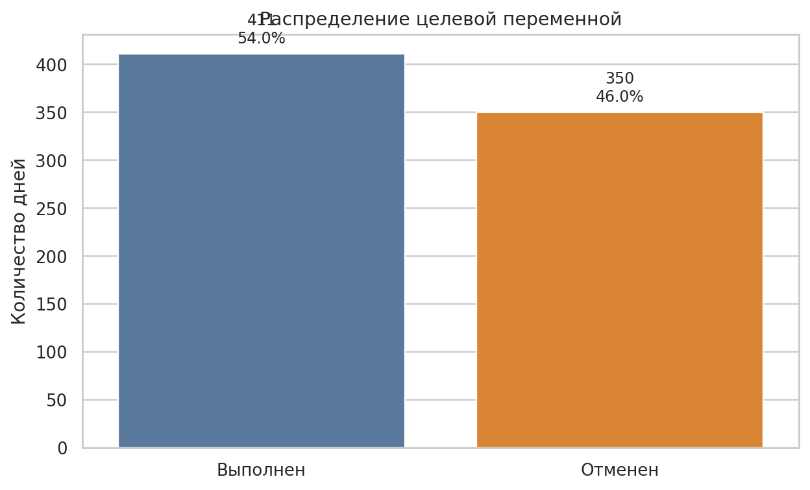
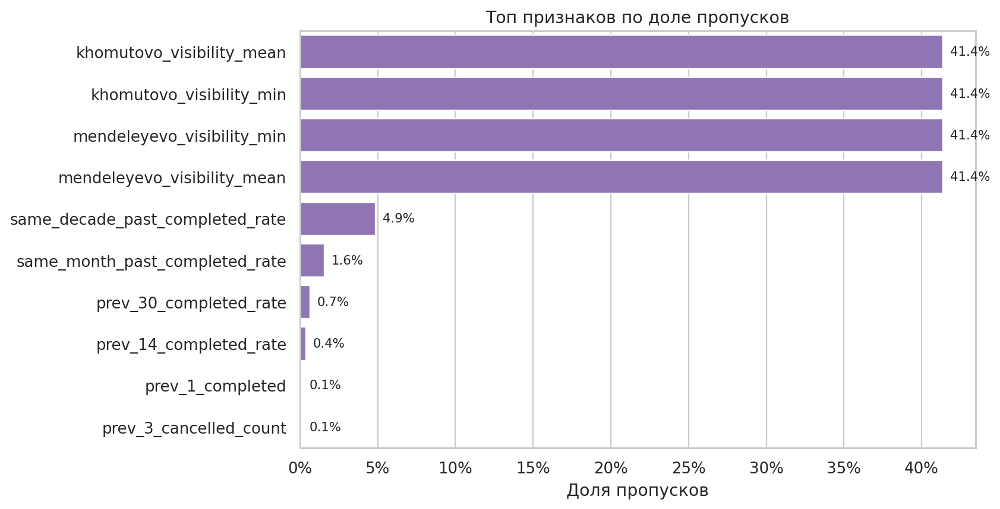
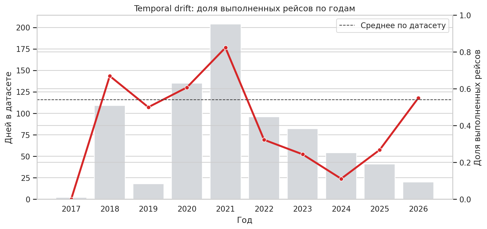
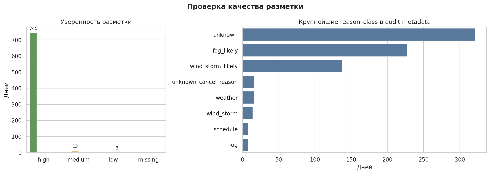
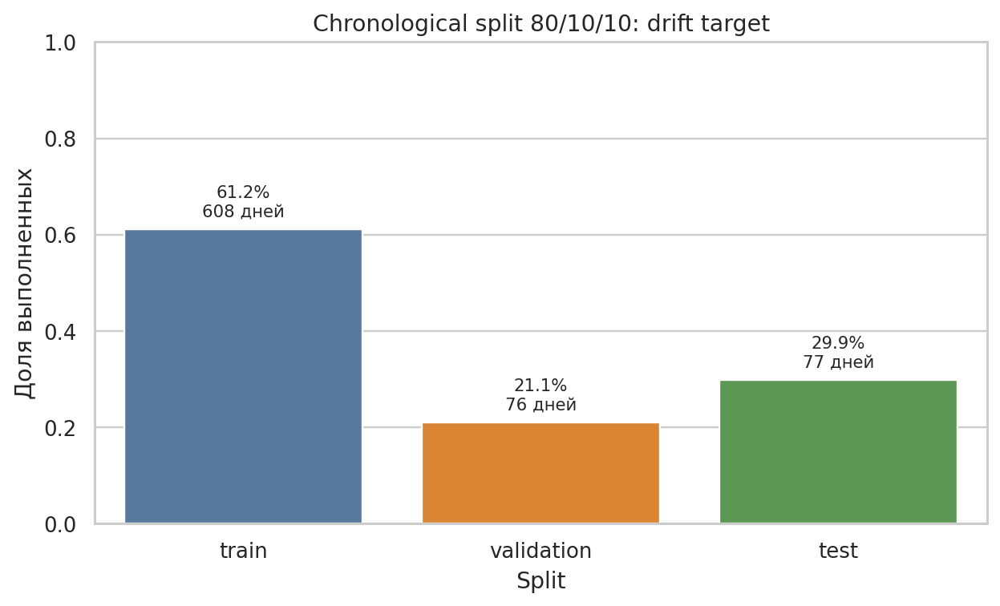
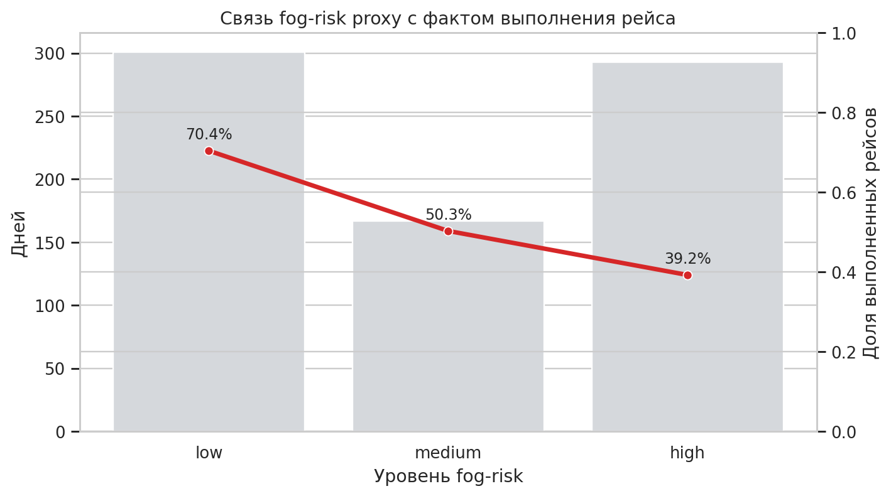

# Подготовка датасета для задачи машинного обучения

Документ фиксирует подготовку датасета для ML-задачи проекта `flyforecast`: прогноз вероятности выполнения авиарейса из/в аэропорт Менделеево на выбранную дату.

Итоговый датасет для первых ML-экспериментов:

```text
data/processed/training_dataset_v1.csv
```

Целевая переменная:

```text
is_flight_completed
```

Классы:

- `1` — рейс выполнен;
- `0` — рейс не выполнен/отменён.

Задача является supervised binary classification с вероятностным прогнозом. В продукте важна не только классификация `yes/no`, но и качество вероятности `probability_flight`.

---

## 1. Источник и состав данных

### Какие данные используются

В проекте используется несколько слоёв данных.

Основной исторический источник:

- Telegram-канал «Аэропорт на Кунашире(НЕофициально)» / `t.me/aeroportuk`;
- сырые сообщения канала;
- автоматическая разметка сообщений и дневных событий;
- ручная проверка спорных случаев.

Дополнительные источники подтверждения:

- онлайн-табло аэропорта Южно-Сахалинска `airportus.ru/board`;
- архивные снимки табло через Wayback Machine;
- новости аэропорта `airportus.ru/news/post/{id}`;
- отдельные публикации ASTV, Sakh.online, TASS, Aviaport;
- hourly collector текущего табло;
- Open-Meteo Archive для исторической погоды;
- Open-Meteo Forecast для текущего baseline-прогноза.

Для обучения используется не сырой текст, а подготовленный табличный датасет:

```text
data/processed/training_dataset_v1.csv
```

Он построен поверх:

```text
data/processed/dataset_daily_flights_v3.csv
data/interim/weather/open_meteo_daily_weather_v1.csv
data/processed/mendeleyevo_fog_risk_dataset.csv
```

### Где хранятся данные

Ключевые файлы:

| Файл | Назначение |
| --- | --- |
| `data/raw/telegram/aeroportuk_messages.csv` | сырые Telegram-сообщения |
| `data/interim/labels/message_flight_labels.csv` | message-level разметка |
| `data/interim/labels/daily_flight_labels.csv` | day-level разметка Telegram |
| `data/raw/flight_status/kunashir_historical_sources_v3.csv` | historical evidence из табло, новостей и media |
| `data/raw/flight_status/kunashir_flight_status_hourly.csv` | hourly-наблюдения текущего табло |
| `data/interim/flight_status/manual_review_applied_v3.csv` | применённая ручная проверка |
| `data/processed/dataset_daily_flights_v3.csv` | binary fact dataset v3 |
| `data/interim/weather/open_meteo_daily_weather_v1.csv` | daily weather cache |
| `data/processed/training_dataset_v1.csv` | итоговый training dataset v1 |
| `data/processed/mendeleyevo_fog_risk_dataset.csv` | отдельный датасет признаков тумана/низкой облачности по Менделеево |

Данные в `data/` не должны считаться публичной частью репозитория. Они являются рабочим активом проекта, поэтому будут предоставлены проверяющему отдельно.

### Формат данных

Формат основных датасетов — CSV в кодировке UTF-8/UTF-8-SIG.

`training_dataset_v1.csv` содержит:

- `date`;
- target: `status`, `is_flight_completed`;
- audit metadata: `label_confidence`, `reason_class`, `message_count`, `event_date_sources`;
- календарные признаки: `year`, `month`, `day`, `day_of_year`, `month_decade`, `season`;
- weather features по двум точкам:
  - `mendeleyevo_*`;
  - `khomutovo_*`;
- rolling history features;
- `training_data_version`.

Важно: audit metadata хранится в датасете для анализа качества, но не должна использоваться как feature при обучении модели.

### Регулярное обновление

В проекте нужно различать автоматические регулярные процессы и воспроизводимые batch-сборки.

Автоматические регулярные процессы:

- hourly collector табло:

```bash
python pipelines/flight_status/collect_kunashir_status.py --loop --interval-seconds 900
```

- forecast monitor:

```bash
python pipelines/evaluation/forecast_monitor.py --loop --interval-seconds 900
```

Воспроизводимые batch-сборки, которые сейчас запускаются вручную или по событию:

- сборка v3 fact dataset:

```bash
python pipelines/flight_status/build_dataset_v3.py
```

- сборка training dataset:

```bash
python pipelines/training/build_training_dataset_v1.py --refresh-weather
python pipelines/training/build_mendeleyevo_fog_risk_dataset.py
```

Hourly collector обновляет текущие наблюдения примерно раз в час. Forecast monitor также работает циклически и формирует ledger прогнозов/исходов. Это соответствует предполагаемому использованию модели: фактические исходы рейсов можно фиксировать после завершения операционного дня, а качество прогнозов оценивать с лагом `D+2`.

Сборку `dataset_daily_flights_v3.csv` и `training_dataset_v1.csv` корректнее считать не регулярными процессами, а подготовленными reproducible jobs. Их достаточно запускать батчево:

- после накопления новых финализированных фактов;
- после ручного review спорных дней;
- перед новым ML-экспериментом;
- перед выпуском новой `model_version`.

В будущем эти batch-сборки можно автоматизировать, например ежедневным cron/job после финализации исходов, но на текущем этапе они не являются автоматически регулярными.

### Объём данных

Состояние на текущую сборку:

| Слой | Объём |
| --- | ---: |
| Raw Telegram messages | `7111` сообщений |
| Message-level labels | `7111` строк |
| Daily Telegram labels | `2076` дней |
| Historical sources v3 | `289` evidence rows |
| Hourly board snapshot | `1030` rows |
| Dataset v2 | `699` binary days |
| Dataset v3 | `761` binary days |
| Training dataset v1 | `761` rows, `106` columns |
| Weather cache | `1522` rows: 761 день * 2 точки |

Период `training_dataset_v1.csv`:

```text
2017-12-13 -> 2026-05-26
```

Код, которым проверяется объём и период итогового датасета:

```python
from pathlib import Path
import pandas as pd

root = Path(".")
training = pd.read_csv(
    root / "data/processed/training_dataset_v1.csv",
    parse_dates=["date"],
)

summary = {
    "rows": len(training),
    "columns": training.shape[1],
    "date_min": training["date"].min().date(),
    "date_max": training["date"].max().date(),
    "target_counts": training["is_flight_completed"].value_counts().to_dict(),
}
summary
```

Объём достаточен для:

- MVP baseline;
- первичной Logistic Regression;
- простых tree-based моделей;
- оценки Brier Score и калибровки;
- проверки влияния погоды/сезонности.

Объём пока недостаточен для:

- сложных нейросетевых моделей;
- уверенной оценки редких причин отмен;
- отдельной модели по каждому типу причины;
- тонкого моделирования по конкретному номеру рейса/направлению.

### Какие данные желательно собрать дополнительно

Желательно добавить:

- больше официальных historical outcomes из табло/новостей;
- фактические статусы рейсов после 2026-05-26 через hourly collector;
- отдельные признаки по расписанию и номеру рейса;
- airport operational data, если появится легальный источник;
- более точные погодные признаки в окне времени рейса;
- видимость, туман, нижнюю облачность и dew point spread через текущий Open-Meteo forecast и отдельный fog-risk dataset;
- ручную доразметку спорных `delayed/combined` дней.

---

## 2. Базовый EDA

### Итоговый training dataset

Файл:

```text
data/processed/training_dataset_v1.csv
```

Размер:

```text
761 строка
106 колонок
```

Целевая переменная:

```text
is_flight_completed
```

Распределение классов:

| Класс | Значение | Количество | Доля |
| --- | --- | ---: | ---: |
| выполнен | `1` | `411` | `54.0%` |
| отменён/не выполнен | `0` | `350` | `46.0%` |

Дисбаланс умеренный. Редких классов в финальной binary target нет.

Код расчёта распределения классов:

```python
target_distribution = (
    training["is_flight_completed"]
    .value_counts()
    .rename_axis("is_flight_completed")
    .reset_index(name="count")
)
target_distribution["share"] = (
    target_distribution["count"] / target_distribution["count"].sum()
)
target_distribution
```



### Raw/interim классы

На message-level разметке:

| Статус | Количество |
| --- | ---: |
| `unknown` | `5054` |
| `completed` | `694` |
| `cancelled` | `631` |
| `planned` | `429` |
| `delayed` | `303` |

На daily-level Telegram разметке:

| Статус | Количество |
| --- | ---: |
| `unknown` | `1183` |
| `completed` | `381` |
| `cancelled` | `318` |
| `planned` | `122` |
| `delayed` | `72` |

Для ML target используются только финальные binary статусы `completed` и `cancelled`. Статусы `unknown`, `planned`, `delayed`, `combined/disrupted` не используются как target без дополнительной проверки.

### Дубликаты

Найдены:

- raw Telegram: `0` полных дублей строк;
- raw Telegram: `0` дублей `message_id`;
- raw Telegram: `2109` повторяющихся текстов;
- daily labels: `0` дублей дат;
- dataset v2: `0` полных дублей;
- dataset v3: `0` полных дублей;
- training dataset v1: `0` полных дублей, `0` дублей дат.

Повторяющиеся Telegram-тексты не удаляются автоматически на raw stage, потому что однотипные служебные сообщения могут относиться к разным датам. При split для текстовой модели близкие дубли нельзя допускать в разные выборки. Для текущей day-level модели используется один объект на дату, поэтому риск ниже.

### Пропуски

В `training_dataset_v1.csv`:

| Поле | Доля пропусков |
| --- | ---: |
| `khomutovo_visibility_min` | `41.39%` |
| `khomutovo_visibility_mean` | `41.39%` |
| `mendeleyevo_visibility_min` | `41.39%` |
| `mendeleyevo_visibility_mean` | `41.39%` |
| `same_decade_past_completed_rate` | `4.86%` |
| `same_month_past_completed_rate` | `1.58%` |
| `prev_30_completed_rate` | `0.66%` |
| `prev_14_completed_rate` | `0.40%` |
| `days_since_last_cancelled` | `0.13%` |
| `prev_1_completed` | `0.13%` |
| `prev_7_cancelled_count` | `0.13%` |
| `prev_3_cancelled_count` | `0.13%` |

Вывод:

- historical visibility заполнена только для части периода, поэтому ее нельзя считать стабильным единственным историческим признаком;
- для тумана используем proxy-признаки: влажность, dew point spread, низкая облачность, weather code, осадки и ветер;
- rolling-пропуски в начале временного ряда нормальны и могут заполняться медианой/нейтральным значением;
- target и дата заполнены полностью.

Код расчёта пропусков:

```python
missing_top = (
    training.isna()
    .mean()
    .sort_values(ascending=False)
    .head(12)
    .rename("missing_share")
    .reset_index(names="feature")
)
missing_top
```



### Длины текстов

Текстовая статистика по `data/raw/telegram/aeroportuk_messages.csv`:

| Метрика | Значение |
| --- | ---: |
| сообщений | `7111` |
| min length | `1` |
| mean length | `156.24` |
| median length | `54` |
| 75 percentile | `106` |
| 90 percentile | `642` |
| 95 percentile | `732` |
| 99 percentile | `951.5` |
| max length | `3654` |
| пустых текстов | `0` |

В текущей ML-постановке модель не обучается на сыром тексте. Тексты нужны для разметки, аудита и объяснения качества labels. Если позже появится NLP-модель для разметки статусов, потребуется отдельная стратегия очистки и split по близким дублям.

### Примеры типичных текстов

Типичные сообщения `completed`:

```text
В Южном делают регистрацию к нам, чтобы при появлении погоды начать посадку.
Вылетел из Южного в 10-58. Начинаем регистрацию.
```

Типичные сообщения `cancelled`:

```text
Сегодня рейс отменили. Завтра вылет из Южно-Сахалинска первого рейса в 10-00...
Второй рейс отменен, пассажирам этого рейса необходимо приехать на регистрацию к первому рейсу.
```

Типичные сообщения `delayed`:

```text
Рейс задерживается с вылетом из Южно-Сахалинска до 11-00. В Менделеево нет погоды.
Задержан из Южного до 13-20.
```

Типичные сообщения `planned`:

```text
Погода есть, аэропорт готов, рейс по расписанию...
В аэропорту погода летная (пока). Рейсы Авроры по расписанию.
```

### Спорные и неоднозначные объекты

Спорные случаи выделялись в:

```text
data/interim/flight_status/needs_manual_review_v3.csv
```

Причины review:

| Причина | Количество |
| --- | ---: |
| `historical_unknown` | `16` |
| `historical_disruption_without_final_outcome` | `11` |
| `historical_disruption_with_telegram_binary_outcome` | `10` |
| `telegram_historical_binary_conflict` | `2` |

Примеры неоднозначности:

- задержка есть, но финальный исход не найден;
- табло показывает `combined`, но нужно понять, считать ли исход отменой конкретной даты;
- Telegram говорит `cancelled`, historical source говорит `delayed`;
- новость описывает расписание или продажу билетов, но не факт выполнения рейса.

Итог ручного review:

- применено: `36` строк;
- `cancelled`: `20`;
- `completed`: `16`;
- исключено как `unknown`: `4` строки.

### Особенности, влияющие на качество модели

Найденные закономерности:

- облачность, ветер, осадки и давление в Менделеево заметно связаны с отменами;
- сезонность сильная: январь хуже мая/июля;
- recent cancellation rolling features дают сильный сигнал, но нужно следить за отсутствием утечки;
- данные по годам неоднородны: поздние годы содержат больше подтверждений из новых источников;
- historical visibility доступна только с части временного ряда, но добавлен отдельный fog-risk dataset на proxy-признаках;
- `reason_class` и `message_count` нельзя использовать в модели как признаки, потому что это post-fact metadata.

Код проверки drift по годам:

```python
completion_by_year = (
    training.assign(year_from_date=training["date"].dt.year)
    .groupby("year_from_date")["is_flight_completed"]
    .agg(days="size", completion_rate="mean")
    .reset_index()
)
completion_by_year
```



---

## 3. Качество данных и разметки

### Есть ли разметка

Да. Разметка есть на нескольких уровнях:

- message-level labels;
- daily Telegram labels;
- historical evidence labels;
- manual review labels;
- final binary labels в `dataset_daily_flights_v3.csv`;
- target `is_flight_completed` в `training_dataset_v1.csv`.

### Кто и как создавал разметку

Разметка формировалась поэтапно:

1. Автоматические правила по текстам Telegram.
2. Агрегация message-level labels в day-level labels.
3. Сбор independent evidence из airportus/Wayback/news/media.
4. Выделение конфликтных и неоднозначных дней.
5. Ручная проверка спорных случаев.
6. Применение binary rows в v3 dataset.

Отдельно зафиксирован ручной override:

```text
2026-05-19 -> cancelled
reason_class: fog
source: telegram_manual_review_2026_05
```

### Достаточно ли разметки

Для первого binary classifier разметки достаточно:

- `761` объект;
- два класса представлены близко к балансу;
- нет редкого target-класса.

Для сложных моделей и отдельных причин отмен разметки недостаточно. `reason_class` сильно неоднороден и не должен становиться самостоятельной целевой переменной в текущей версии.

Код для проверки уверенности разметки и крупнейших `reason_class`:

```python
label_confidence = (
    training["label_confidence"]
    .fillna("missing")
    .value_counts()
    .rename_axis("label_confidence")
    .reset_index(name="days")
)

reason_classes = (
    training["reason_class"]
    .fillna("missing")
    .value_counts()
    .head(8)
    .rename_axis("reason_class")
    .reset_index(name="days")
)
```



### Ошибки и шум

Основные источники шума:

- Telegram является неофициальным источником;
- короткие сообщения могут быть неполными;
- часть сообщений относится к расписанию, а не факту;
- delayed/combined не всегда содержит финальный исход;
- historical media иногда описывает несколько рейсов и несколько дат;
- некоторые новости airportus описывают продажи/расписание, а не выполнение рейса.

### Неоднозначные случаи

Наиболее сложные категории:

- `delayed` без финального исхода;
- `combined` с переносом на следующий день;
- planned-only строки;
- источники с общими новостями о расписании;
- конфликт Telegram vs official/history evidence.

### Требуется ли доразметка

Да, но не массовая. Нужна точечная доразметка:

- новые дни, собранные hourly collector;
- delayed/combined cases;
- дни с conflict evidence;
- дни, где automated labels дают `unknown`;
- отдельные погодные отмены для проверки `reason_class`.

Оценка ресурсов:

- первичная проверка одного спорного дня: 2-5 минут;
- 50 спорных дней: 2-4 часа;
- двойная разметка 10-20% спорных случаев: ещё 1-2 часа человека;
- регулярный weekly review новых спорных дней: 20-40 минут в неделю на текущем объёме.

### Какие классы размечены хуже всего

В target хуже всего не `completed/cancelled`, а промежуточные статусы, которые не входят в финальный binary dataset:

- `delayed`;
- `combined/disrupted`;
- `planned_only`;
- `unknown`.

Их нельзя напрямую смешивать с `completed/cancelled`.

### Как повысить качество разметки

Рекомендуемые меры:

- продолжать ручную проверку спорных примеров;
- хранить инструкцию для ручной проверки;
- не считать `scheduled/planned` фактом выполнения;
- объединять редкие и близкие reason classes;
- использовать official/Wayback/board evidence как приоритетный слой;
- делать двойную разметку части конфликтных дней;
- фиксировать `data_version` после каждого изменения правил;
- сохранять excluded audit, а не удалять сомнительные строки бесследно.

---

## 4. Конфиденциальность и юридические ограничения

### Персональные данные

Текущие structured datasets не содержат явных полей ФИО, телефонов, адресов или аккаунтов пользователей.

Однако raw Telegram texts теоретически могут содержать:

- случайно упомянутые имена;
- бытовые детали;
- ссылки;
- служебные идентификаторы сообщений;
- тексты публичного канала.

Поэтому raw data нужно считать чувствительным рабочим слоем и не передавать без необходимости.

### Чувствительная информация

Чувствительной для проекта является:

- накопленный historical dataset;
- ручная разметка;
- prediction logs;
- operational flight status snapshot;
- любые сырые тексты из Telegram/media.

Даже если данные взяты из публичных источников, итоговый собранный датасет является ценным производным активом проекта.

### Обезличивание

Для ML-модели не нужно использовать raw Telegram text. В production и в LLM explanation передаются только безопасные агрегированные признаки:

- дата;
- вероятность;
- confidence;
- погодные и historical factors;
- model/data version.

Перед публикацией или передачей датасета нужно:

- удалить raw texts;
- удалить URLs сообщений при необходимости;
- оставить только агрегированные day-level признаки;
- не передавать `.env`, prediction logs и приватные server snapshots.

### Ограничения для экспериментов

Можно использовать:

- `training_dataset_v1.csv`;
- агрегированные features;
- binary target;
- Open-Meteo weather features.

Нужно избегать:

- публикации raw Telegram text;
- передачи raw text во внешние сервисы;
- обучения на post-fact metadata как на predictive features;
- использования неочищенных источников в production model без review.

---

## 5. Проблемы данных и предобработка

### Найденные проблемы

| Проблема | Где найдена | Решение |
| --- | --- | --- |
| Повторяющиеся Telegram texts | raw Telegram | не удалять на raw stage, контролировать при NLP split |
| `unknown/planned/delayed` статусы | interim labels | исключать из binary target без review |
| `combined/disrupted` | board/historical evidence | ручная логика: если нет completed evidence за дату, считать cancelled только после проверки |
| Частично заполненный historical visibility | training v1/fog-risk | использовать с missing indicator или сравнивать с no-visibility feature set |
| Rolling NaN в начале ряда | training v1 | заполнить медианой/нейтральным значением внутри train pipeline |
| Excel/CSV артефакты `;date`, trailing `;;;;` | локальный v3 CSV | чистка заголовков при чтении |
| Смешанные reason classes | `reason_class` | не использовать как target; унифицировать для аналитики |
| Служебные/общие новости | historical sources | exclude/manual review |
| Temporal drift | годы 2017-2026 | time-based validation, rolling backtesting |

### Предобработка для текущей ML-задачи

Перед обучением:

1. Читать `training_dataset_v1.csv`.
2. Отсортировать по `date`.
3. Проверить уникальность `date`.
4. Удалить/исключить из features:
   - `status`;
   - `is_flight_completed`;
   - `label_confidence`;
   - `reason_class`;
   - `message_count`;
   - `transport_types`;
   - `event_date_sources`;
   - `data_version`;
   - `training_data_version`;
   - `visibility_*` без проверки coverage и missing indicator.
5. Категориальные признаки (`season`) закодировать one-hot или заменить числовыми циклическими признаками.
6. Numeric NaN заполнить только по train statistics.
7. Масштабировать признаки для Logistic Regression.
8. Для tree-based моделей масштабирование необязательно.

---

## 6. Формирование train/validation/test

### Почему не обычная случайная стратификация

Задача прогнозирует будущие даты. Случайное разбиение может дать утечку времени: модель будет обучаться на будущих годах и тестироваться на прошлых. Поэтому основной split должен быть хронологическим.

Стратификацию по классам можно использовать только для вспомогательных sanity-check экспериментов, но не как главную оценку production-качества.

### Рекомендуемое разбиение сейчас

Для текущих `761` строки рекомендуется chronological 80/10/10:

| Split | Даты | Строк | Классы | Доля completed |
| --- | --- | ---: | --- | ---: |
| train | `2017-12-13` — `2023-07-12` | `608` | `{1: 372, 0: 236}` | `61.2%` |
| validation | `2023-07-14` — `2024-07-30` | `76` | `{1: 16, 0: 60}` | `21.1%` |
| test | `2024-08-01` — `2026-05-26` | `77` | `{1: 23, 0: 54}` | `29.9%` |

Это разбиение не идеально сбалансировано, но честно показывает temporal drift. Именно такой drift модель должна выдерживать в реальном использовании.

Код формирования chronological split:

```python
df = training.sort_values("date").reset_index(drop=True)
n = len(df)
train_end = int(n * 0.80)
valid_end = int(n * 0.90)

df["split"] = "test"
df.loc[: train_end - 1, "split"] = "train"
df.loc[train_end : valid_end - 1, "split"] = "validation"

split_summary = (
    df.groupby("split", sort=False)
    .agg(
        start=("date", "min"),
        end=("date", "max"),
        rows=("date", "size"),
        completed=("is_flight_completed", "sum"),
        completion_rate=("is_flight_completed", "mean"),
    )
)
split_summary
```



Дополнительно можно вести rolling-origin validation:

1. Train до даты `T`.
2. Validate на следующем временном окне.
3. Сдвинуть `T`.
4. Повторить несколько раз.

Это особенно важно при малом объёме данных.

### Алгоритм формирования выборки

1. Собрать/обновить `dataset_daily_flights_v3.csv`.
2. Собрать `training_dataset_v1.csv`.
3. Проверить schema, даты, дубли и target.
4. Исключить строки без binary target.
5. Исключить leakage columns из feature set.
6. Отсортировать по `date`.
7. Разделить по времени на train/validation/test.
8. Fit preprocessing только на train.
9. Применить preprocessing к validation/test.
10. Зафиксировать:
    - dataset version;
    - split dates;
    - feature list;
    - model version;
    - metrics.

### Как не допустить утечки

Нельзя использовать:

- `status`;
- `reason_class`;
- `label_confidence`;
- `message_count`;
- `event_date_sources`;
- любые evidence/status поля, появляющиеся после факта;
- weather archive для будущих дат в production-сценарии ближнего прогноза, если на момент прогноза доступен только forecast.

Важно разделить два режима:

- offline training может использовать historical weather archive как приближение фактической погоды дня;
- production inference для будущей даты должен использовать forecast weather только там, где forecast реально доступен.

Для дальних дат без прогноза погоды нужна отдельная seasonal/historical logic.

### Что делать с редкими классами

В финальном binary target редких классов нет. В промежуточных статусах редкими являются:

- `technical`;
- `fog`;
- `schedule`;
- `combined/disrupted`;
- отдельные reason classes.

Они не должны быть отдельными target-классами в текущей модели. Их можно использовать только для анализа ошибок или после накопления данных.

---

## 7. Стратегия валидации и метрики

### Основная метрика

Главная метрика:

```text
Brier Score
```

Причина: продукт показывает вероятность, а не только класс. Если сервис говорит `70%`, эта вероятность должна быть калиброванной.

### Дополнительные метрики

Использовать:

- ROC-AUC;
- PR-AUC по классу отмен;
- accuracy;
- precision/recall по `completed` и `cancelled`;
- F1-score;
- confusion matrix;
- calibration curve;
- reliability bins;
- сравнение качества по horizon bucket.


В текущей binary-задаче важнее:

- Brier Score;
- calibration;
- recall отмен, чтобы не пропускать рискованные даты;
- precision отмен, чтобы не пугать пользователя слишком часто.

### Baseline для сравнения

Сравнивать ML нужно минимум с:

- актуальным production baseline, описанным в `docs/baseline_model.md`;
- seasonal baseline по месяцу/декаде;
- constant baseline по train completed rate.

ML-модель можно считать полезной только если она:

- не хуже baseline по Brier Score;
- не имеет грубой некалиброванности;
- показывает устойчивость на time-based test;
- не улучшает метрики за счёт утечек.

### Раздельная оценка по горизонту

Нужно оценивать отдельно:

- ближний горизонт, где forecast weather доступен;
- дальний горизонт, где forecast weather недоступен.

Для дальних дат модель не должна притворяться погодной. Это должна быть сезонно-историческая оценка риска.

---

## Итог

Текущий датасет пригоден для первого ML-эксперимента:

- есть supervised binary target;
- классы представлены достаточно равномерно;
- есть погодные, календарные и rolling-признаки;
- есть ручная проверка части спорных labels;
- есть регулярный сбор новых фактов;
- есть baseline для сравнения.

Главные ограничения:

- объём пока небольшой;
- есть temporal drift;
- часть historical labels получена из неофициального Telegram-источника;
- reason classes шумные и не готовы как target;
- historical visibility-признаки заполнены только для части периода, но fog-risk proxy закрывает часть проблемы через низкую облачность, влажность и dew point spread;
- для дальнего горизонта нет forecast weather.

Дальнейший план:

1. Зафиксировать safe feature list.
2. Сформировать chronological train/validation/test split.
3. Обучить Logistic Regression как первый ML baseline.
4. Сравнить с актуальным production baseline и seasonal baseline.
5. Оценить Brier Score, calibration и ошибки по отменам.
6. После этого решить, использовать ML как основную модель, дополнительный слой или оставить baseline для части горизонтов.

---

## Обновления от 28.05.2026

После подключения дополнительных признаков Open-Meteo по координатам аэропорта Менделеево пересобран training dataset и добавлен отдельный fog-risk dataset.

### Что сделано

1. Текущий backend-прогноз усилен погодными признаками для ближнего горизонта:
   - `visibility`;
   - `cloud_cover_low`;
   - `weather_code`;
   - `dew_point_spread`;
   - `fog_low_cloud_risk_score`;
   - `fog_low_cloud_risk_level`.

2. Baseline обновлён до версии:

```text
mvp-baseline-004
```

Новая версия использует risk score тумана/низкой облачности как дополнительную отрицательную погодную поправку для горизонта, где доступен Open-Meteo forecast.

3. Пересобран `training_dataset_v1.csv`:

```text
data/processed/training_dataset_v1.csv
```

Актуальные параметры после пересборки:

| Параметр | Значение |
| --- | ---: |
| Строк | `761` |
| Колонок | `106` |
| Минимальная дата | `2017-12-13` |
| Максимальная дата | `2026-05-26` |
| Completed | `411` |
| Cancelled | `350` |
| Weather feature columns | `74` |
| `training_data_version` | `training-v3-openmeteo-historical-forecast-visibility-2026-05-28` |

4. Добавлен отдельный датасет для анализа тумана и низкой облачности:

```text
data/processed/mendeleyevo_fog_risk_dataset.csv
```

Он строится командой:

```bash
python pipelines/training/build_mendeleyevo_fog_risk_dataset.py
```

Параметры датасета:

| Параметр | Значение |
| --- | ---: |
| Строк | `3088` |
| Период | `2017-12-13..2026-05-27` |
| Размеченных flight days | `761` |
| Visibility non-empty rows | `1892` |

### Новые признаки и пропуски

Обычный Open-Meteo Archive по-прежнему не отдаёт historical `visibility`, но Historical Forecast API отдаёт этот признак начиная с `2021-03-23`. Поэтому visibility теперь можно использовать для части временного ряда, но модель должна корректно обрабатывать пропуски на ранних датах.

| Признак | Пропусков |
| --- | ---: |
| `mendeleyevo_visibility_min` | `41.39%` |
| `mendeleyevo_visibility_mean` | `41.39%` |
| `khomutovo_visibility_min` | `41.39%` |
| `khomutovo_visibility_mean` | `41.39%` |

Новые proxy-признаки тумана/низкой облачности по-прежнему заполнены полностью:

| Признак | Пропусков |
| --- | ---: |
| `mendeleyevo_cloud_cover_low_mean` | `0.00%` |
| `mendeleyevo_cloud_cover_low_max` | `0.00%` |
| `mendeleyevo_dew_point_spread_mean` | `0.00%` |
| `mendeleyevo_dew_point_spread_le_2_flag` | `0.00%` |
| `mendeleyevo_fog_low_cloud_risk_score` | `0.00%` |
| `mendeleyevo_fog_low_cloud_risk_level` | `0.00%` |

Покрытие visibility:

| Параметр | Значение |
| --- | --- |
| Первая дата с `mendeleyevo_visibility_min` | `2021-03-23` |
| Последняя дата с `mendeleyevo_visibility_min` | `2026-05-26` |
| Заполненных строк в `training_dataset_v1.csv` | `446 из 761` |

### Предварительная связь fog-risk с исходами рейсов

На размеченных `761` днях fog-risk уже даёт ожидаемую градацию: чем выше риск тумана/низкой облачности, тем ниже доля выполненных рейсов.

| Fog-risk level | Дней | Completion rate |
| --- | ---: | ---: |
| `high` | `293` | `0.3925` |
| `medium` | `167` | `0.5030` |
| `low` | `301` | `0.7043` |

Код расчёта связи fog-risk proxy с target:

```python
fog = pd.read_csv(
    "data/processed/mendeleyevo_fog_risk_dataset.csv",
    parse_dates=["date"],
)
fog_labeled = fog[fog["is_flight_completed"].isin([0, 1])]

fog_summary = (
    fog_labeled.groupby("fog_low_cloud_risk_level")["is_flight_completed"]
    .agg(days="size", completion_rate="mean")
    .reindex(["low", "medium", "high"])
    .reset_index()
)
fog_summary
```



Дополнительно по buckets минимальной visibility на размеченных днях с доступной видимостью:

| Visibility bucket | Дней | Completion rate |
| --- | ---: | ---: |
| `<=1km` | `290` | `0.3966` |
| `1-3km` | `44` | `0.4318` |
| `3-6km` | `18` | `0.3333` |
| `6-10km` | `29` | `0.7241` |
| `>10km` | `65` | `0.7077` |

Это не доказывает причинность и не заменяет полноценную валидацию, но подтверждает, что proxy-признаки идут в правильном направлении и могут быть полезны для модели.

### Как теперь трактовать датасеты

- `dataset_daily_flights_v3.csv` остаётся fact dataset: факт рейса, статус, источник, confidence и reason metadata.
- `training_dataset_v1.csv` остаётся широким ML-dataset: fact labels + календарь + rolling history + погодные признаки.
- `mendeleyevo_fog_risk_dataset.csv` нужен для отдельного анализа тумана/низкой облачности по Менделеево и проверки связи с отменами.

### Что планируется дальше

1. Зафиксировать safe feature list для `training-v3-openmeteo-historical-forecast-visibility-2026-05-28`.
2. Использовать `visibility_*` как частично заполненные признаки и добавить явный missing indicator для периода до `2021-03-23`.
3. Проверить корреляции новых fog-risk признаков с target без temporal leakage.
4. Сделать chronological train/validation/test split.
5. Сравнить:
   - актуальный production baseline;
   - seasonal baseline;
   - fog-risk baseline;
   - Logistic Regression.
6. Оценить отдельно:
   - ближний горизонт, где есть forecast weather;
   - дальний горизонт, где доступна только климатико-историческая оценка.
7. Проверить calibration, Brier Score и ошибки именно по отменам, потому что для продукта особенно важно не пропускать рискованные даты.
